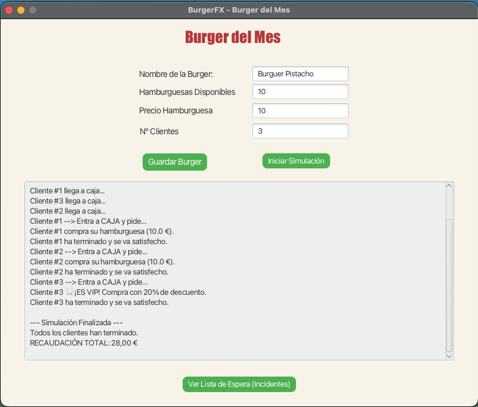
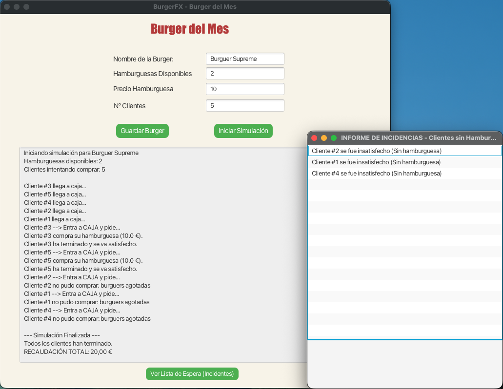
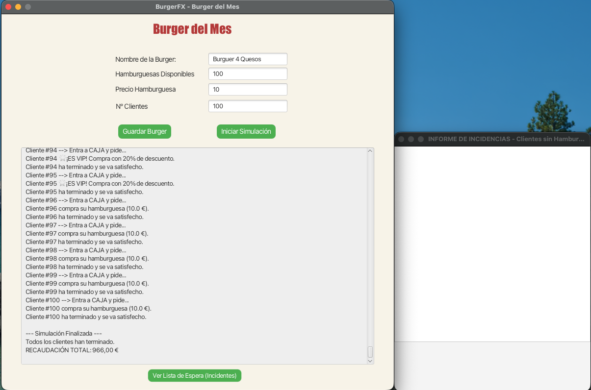

# Informe del Proyecto: De "Taquilla RockStar" a "BurgerFX"

## Descripción del sistema

### ¿Qué sistema has creado?

He desarrollado **BurgerFX**, una aplicación de simulación para una hamburguesería que lanza una edición limitada llamada "Burger del Mes". El sistema simula la llegada concurrente de múltiples clientes que intentan comprar la hamburguesa hasta agotar existencias.

### ¿Qué problema intenta resolver?

El proyecto resuelve problemas clásicos de **concurrencia y gestión de recursos compartidos**:

- **Control de aforo/stock**: Garantizar que no se vendan más hamburguesas de las disponibles.
- **Acceso ordenado**: Gestionar la cola de clientes para que sean atendidos de uno en uno en la caja.
- **Gestión de incidencias**: Registrar y mostrar a los clientes que se quedaron sin producto.

### Qué partes vienen del esqueleto Taquilla RockStar y qué has cambiado

- **Esqueleto (Taquilla RockStar)**: Se mantiene la estructura base de la aplicación JavaFX (`Launcher`, `HelloApplication`), el uso de `Semaphore` para el control de acceso y la actualización de la UI mediante `Platform.runLater`.
- **Cambios (BurgerFX)**:
  - **Dominio**: Cambio de temática de Concierto/Fan a Hamburguesería/Cliente.
  - **Lógica de Negocio**: Implementación de recaudación monetaria, descuentos VIP aleatorios y una lista de espera para clientes sin servicio.
  - **Interfaz**: Nueva ventana para visualizar la lista de espera y cambios estéticos.

---

## Diseño de la solución

### Variables más importantes

- **`hamburguesasDisponibles` (int)**: Contador del stock actual. Es el recurso crítico que disminuye con cada venta.
- **`recaudacionTotal` (double)**: Acumulador del dinero ganado. Se actualiza de forma sincronizada.
- **`semaforo` (Semaphore)**: Controla el acceso a la sección crítica (la caja).
- **`clienteSinBurguer` (List<String>)**: Lista donde se guardan los nombres de los clientes que no pudieron comprar.

### Funcionamiento de la simulación con hilos

Cada **Cliente** es un hilo independiente (`Thread`) que se inicia simultáneamente. Todos compiten por acceder al recurso compartido (`Burguer`). El ciclo de vida de cada hilo simula el comportamiento real: llegar, esperar turno, comprar (o irse) y terminar.

### La cola de espera

- **Llegada**: Cuando el usuario llega, intenta adquirir el semáforo (`semaforo.acquire()`).
- **Espera**: Si el semáforo está ocupado (otro cliente está en caja), el hilo se bloquea y espera su turno en orden FIFO (gracias a `new Semaphore(1, true)`).
- **Atención**: Cuando consigue el semáforo, entra a la caja, verifica si hay stock y realiza la compra. Al terminar, libera el semáforo (`release()`) para el siguiente.

### Vista de "Lista de espera"

- **¿Qué es?**: Es una **nueva ventana secundaria** (`Stage`) que se abre al pulsar el botón "Ver Lista de Espera".
- **¿Qué se ve?**: Contiene un `ListView` que muestra los nombres de todos los clientes que intentaron comprar pero se encontraron con el stock agotado (ej. "Cliente #5 se fue insatisfecho").

---

## Implementación

### Clases creadas o modificadas

- **`Burguer` (Modelo)**: Gestiona el stock, el precio y la recaudación. Contiene el semáforo.
- **`Cliente` (Hilo)**: Representa al consumidor. Ejecuta la lógica de intentar comprar y notificar a la UI.
- **`HelloController` (Controlador)**: Coordina la simulación, actualiza la interfaz gráfica y gestiona la apertura de la ventana de lista de espera.

### Fragmentos de código importantes

**1. Gestión del Semáforo y Stock (Clase `Cliente`)**
Aquí se asegura que solo un cliente entre a la caja a la vez y se verifica el stock de forma segura.

```java
burguer.getSemaforo().acquire(); // Bloquea hasta tener turno
try {
    if (burguer.venderBurguer()) { // Sección crítica: intenta restar stock
        // Lógica de compra...
    } else {
        controller.agregarClienteSinServicio("Cliente #" + id + " sin hamburguesa");
    }
} finally {
    burguer.getSemaforo().release(); // Libera para el siguiente
}
```

**2. Cobro con lógica VIP (Clase `Burguer`)**
Método sincronizado para actualizar la recaudación, aplicando descuento aleatorio.

```java
public synchronized void cobrar(boolean esVip){
    if (esVip) {
        recaudacionTotal += precioBurguer * 0.80; // Descuento 20%
    } else {
        recaudacionTotal += precioBurguer;
    }
}
```

**3. Ventana de Lista de Espera (Clase `HelloController`)**
Creación dinámica de una nueva ventana para mostrar incidencias.

```java
public void verListaEspera(ActionEvent actionEvent) {
    Stage stageLista = new Stage();
    ListView<String> listView = new ListView<>();
    listView.getItems().addAll(clienteSinBurguer); // Carga los datos
    stageLista.setScene(new Scene(new VBox(listView), 400, 500));
    stageLista.show();
}
```

---

## Pruebas realizadas

### Caso 1: Aforo pequeño, pocos usuarios

- **Configuración**: 5 hamburguesas, 3 clientes.
- **Esperado**: Todos los clientes compran. Recaudación = suma de precios. Lista de espera vacía.
- **Resultado**: Correcto. Los 3 hilos terminaron "satisfechos".

{width=90%}

### Caso 2: Aforo pequeño, muchos usuarios (Saturación)

- **Configuración**: 2 hamburguesas, 5 clientes.
- **Esperado**: 2 clientes compran, 3 se quedan sin hamburguesa y aparecen en la lista de espera.
- **Resultado**: Correcto. La ventana de incidencias mostró exactamente a los 3 clientes restantes.

{width=90%}

### Caso 3: Valores extremos

- **Configuración**: 100 hamburguesas, 100 clientes.
- **Esperado**: La simulación no se bloquea (deadlock), la UI se actualiza fluidamente y el dinero cuadra.
- **Resultado**: Correcto. El uso de `Platform.runLater` evitó que la interfaz se congelara.

{width=90%}

---

## Uso de IA y otras ayudas

### Herramientas de IA

He utilizado el asistente de IA para:

- **Generar estructura**: Crear el esqueleto de las clases `Burguer` y `Cliente` basándome en el ejemplo de Taquilla.
- **Depuración**: Entender errores de concurrencia (como `IllegalMonitorStateException`) y corregir la actualización de la UI desde hilos secundarios.
- **Redacción**: Ayuda para estructurar este informe de manera clara.

### Trabajo personal

- **Adaptación**: He adaptado toda la lógica de "Concierto" a "Hamburguesería" manualmente.
- **Implementación VIP**: Diseñé e implementé la lógica de probabilidad del 20% para clientes VIP.
- **Pruebas**: Ejecuté manualmente los casos de prueba y verifiqué los resultados en la interfaz.

---

## Conclusiones personales

### Aprendizaje

- **Hilos y Concurrencia**: He aprendido la importancia de proteger los recursos compartidos (como el contador de hamburguesas) usando `Semaphore` y bloques `synchronized` para evitar datos corruptos.
- **JavaFX**: He entendido que la interfaz gráfica no es "thread-safe" y que cualquier cambio visual desde un hilo de fondo debe hacerse con `Platform.runLater`.
- **Organización**: Separar la lógica (Modelo) de la interfaz (Vista/Controlador) hace que el código sea mucho más fácil de mantener.

### Mejoras futuras

Si tuviera más tiempo, me gustaría implementar:

- Una animación visual de la cola (muñecos esperando).
- Diferentes tipos de hamburguesas con precios distintos.
- Persistencia de datos (guardar el informe en un archivo de texto).
